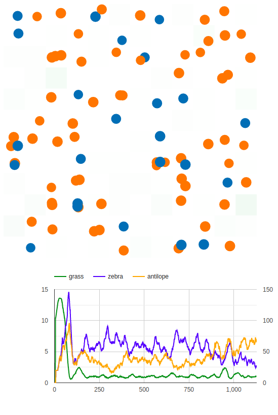

# csc511hw2
```shell script
git clone git@github.com:evilive3000/csc511hw2.git
cd csc511hw2
```

## build c++ app
```shell script
mkdir cmake-build
cd cmake-build
cmake ..
make
```

## prepare node server
```shell script
cd ../visaulization/
npm i
npm run start
```

## results


